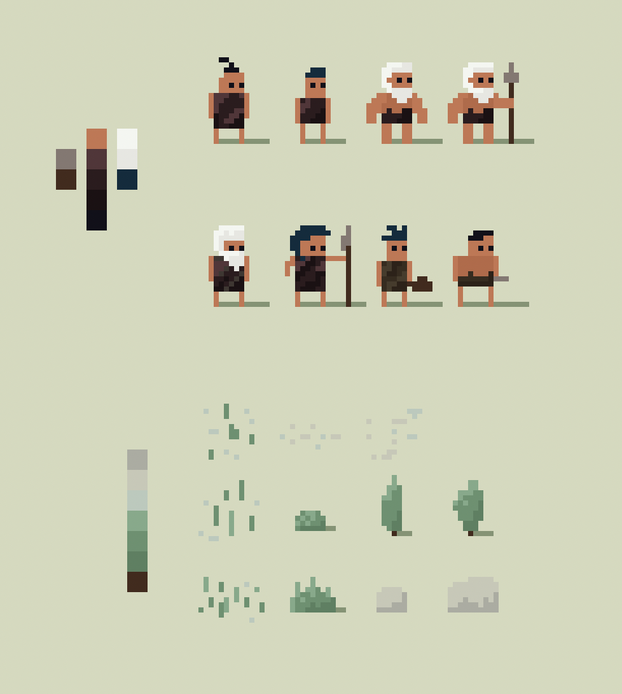
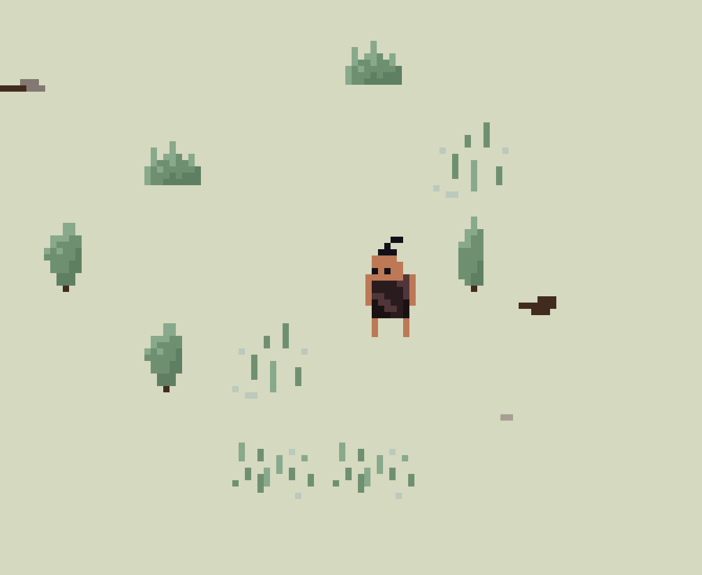
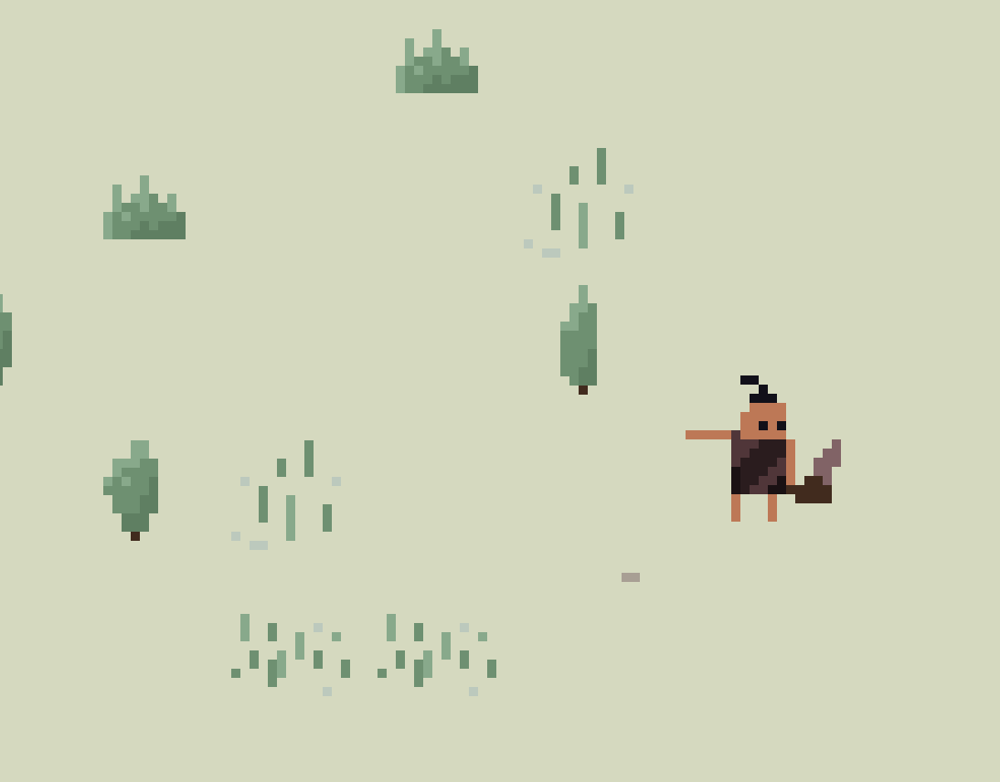

# 🦴 Prehistoric Saturday Game

A small **2.5D top-down combat game** made in **one day** as part of my **Creative Saturday Challenge**. The focus of this challenge was primarily on **learning pixel art** and **implementing melee combat** in Godot for the first time. I managed to only implement a system for equipping weapons on the first day, no game to speak of yet.

## 🎯 Goals
- 🖌 **Learn pixel art** by creating basic tilesets and characters.
- 🪓 **Implement simple melee combat** (attacks, hit reactions).
- 🔥 **Theme: Prehistoric times** – Play as a **caveman** and fight others.
- ⏳ **Fast prototyping** – Prioritize **art and mechanics** over polish.

## 🛠️ Tools Used
- **Game Engine:** [Godot](https://godotengine.org/)
- **Pixel Art:** [Aseprite](https://www.aseprite.org/)
- **Coding Assistant:** [Cursor](https://www.cursor.com/)

## Screenshots

## 📌 Future Plans
The next step is to implement the **melee combat system** that I didn't have time for on day one. After that, I might experiment with expanding this into a **procedural island generator** using **Wave Function Collapse**, adding more depth and world-building to the game.
